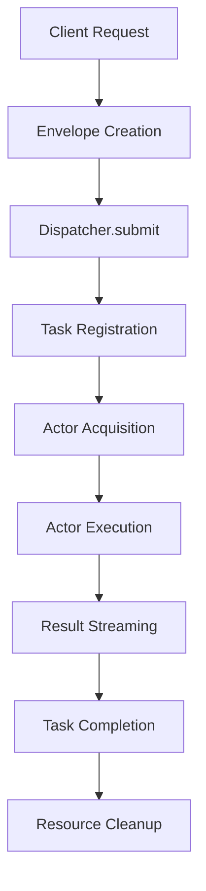
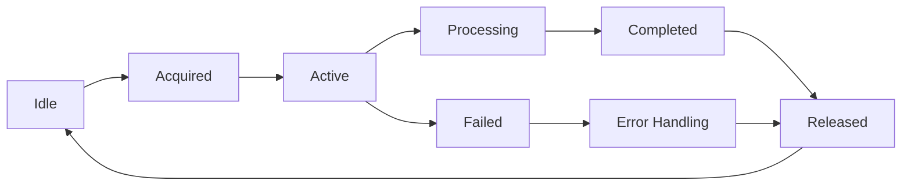

# Actor System Design

## Overview

The Actor System implements the foundational concurrency model for the CoDIN platform, providing fault-tolerant, scalable execution of agents through an actor-based architecture. It manages the lifecycle, scheduling, and communication of actors that host and execute AI agents.

## Architecture

### Core Components

```
┌─────────────────────────────────────────────────────────────────┐
│                     Actor System                               │
│                                                                 │
│  ┌─────────────────┐    ┌─────────────────┐    ┌─────────────────┐ │
│  │   Dispatcher    │    │ ActorSupervisor │    │  TaskRegistry   │ │
│  │   (Routing)     │◄───┤  (Lifecycle)    │◄───┤   (Tracking)    │ │
│  └─────────────────┘    └─────────────────┘    └─────────────────┘ │
│           │                       │                       │         │
│  ┌─────────────────┐    ┌─────────────────┐    ┌─────────────────┐ │
│  │   Envelope      │    │   ActorInfo     │    │   TaskInfo      │ │
│  │   (Messages)    │    │   (Metadata)    │    │   (State)       │ │
│  └─────────────────┘    └─────────────────┘    └─────────────────┘ │
│           │                       │                       │         │
│  ┌─────────────────┐    ┌─────────────────┐    ┌─────────────────┐ │
│  │   Mailbox       │    │ CallableActor   │    │   WorkStealing  │ │
│  │   (Queue)       │    │   (Protocol)    │    │   (LoadBalance) │ │
│  └─────────────────┘    └─────────────────┘    └─────────────────┘ │
└─────────────────────────────────────────────────────────────────┘
```

## Core Interfaces

### CallableActor Protocol

```python
class CallableActor(Protocol):
    """Protocol defining the interface for actors."""
    
    async def __call__(self, input_data: ActorRunInput) -> AsyncIterator[ActorRunOutput]:
        """Execute actor with input data and yield outputs."""
        ...
    
    @property
    def capabilities(self) -> Set[str]:
        """Return set of capabilities this actor provides."""
        ...
    
    async def cleanup(self) -> None:
        """Clean up actor resources."""
        ...
```

### Dispatcher Interface

```python
class Dispatcher(ABC):
    """Abstract dispatcher for routing requests to actors."""
    
    @abstractmethod
    async def submit(self, envelope_dict: Dict[Any, Any]) -> str:
        """Submit request envelope for processing."""
        pass
    
    @abstractmethod
    async def signal(self, runner_id: str, signal: str) -> bool:
        """Send control signal to running task."""
        pass
    
    @abstractmethod
    async def get_status(self, runner_id: str) -> Optional[DispatchResult]:
        """Get status of submitted task."""
        pass
    
    @abstractmethod
    async def get_stream_queue(self, runner_id: str) -> asyncio.Queue:
        """Get streaming output queue for task."""
        pass
```

## Message Flow

### Request Processing



### Actor Lifecycle



## Implementation Details

### LocalDispatcher

The primary dispatcher implementation for single-node deployment:

```python
class LocalDispatcher(Dispatcher):
    def __init__(
        self,
        supervisor: ActorSupervisor,
        task_registry: TaskRegistry = None
    ):
        self.supervisor = supervisor
        self.task_registry = task_registry or TaskRegistry()
        self._stream_queues: Dict[str, asyncio.Queue] = {}
        self._stop_signals: Set[str] = set()
        self._pause_signals: Set[str] = set()
    
    async def submit(self, envelope_dict: Dict[Any, Any]) -> str:
        """Submit work envelope for processing."""
        envelope = Envelope.from_dict(envelope_dict)
        
        if envelope.kind == EnvelopeKind.WORK:
            return await self._process_work_envelope(envelope)
        elif envelope.kind == EnvelopeKind.CONTROL:
            return await self._process_control_envelope(envelope)
        else:
            raise ValueError(f"Invalid envelope kind: {envelope.kind}")
    
    async def _process_work_envelope(self, envelope: Envelope) -> str:
        """Process work envelope by acquiring actor and executing."""
        payload = envelope.payload
        runner_id = payload.runner_id
        
        # Register task
        task_id = await self.task_registry.add_task(
            runner_id=runner_id,
            request_id=payload.request_id,
            metadata={"agent_id": payload.agent_id}
        )
        
        # Acquire actor
        actor_info = await self.supervisor.acquire(payload.agent_id)
        
        # Execute in background
        asyncio.create_task(self._execute_actor(actor_info, payload, task_id))
        
        return runner_id
```

### ActorSupervisor

Manages actor lifecycle and resource allocation:

```python
class LocalActorManager(ActorSupervisor):
    def __init__(self, max_actors: int = 10):
        self._actors: Dict[str, ActorInfo] = {}
        self._max_actors = max_actors
        self._actor_lock = asyncio.Lock()
    
    async def acquire(self, agent_id: str) -> ActorInfo:
        """Acquire an actor for the specified agent."""
        async with self._actor_lock:
            # Check for idle actor
            if agent_id in self._actors:
                info = self._actors[agent_id]
                if info.status == "idle":
                    info.status = "active"
                    return info
            
            # Create new actor if under limit
            if len(self._actors) < self._max_actors:
                actor_instance = await self._create_actor_instance(agent_id)
                info = ActorInfo(
                    actor_id=agent_id,
                    actor_instance=actor_instance,
                    capabilities=actor_instance.capabilities,
                    status="active"
                )
                self._actors[agent_id] = info
                return info
            
            # Wait for available actor or create new instance
            actor_instance = await self._create_actor_instance(agent_id)
            return ActorInfo(
                actor_id=agent_id,
                actor_instance=actor_instance,
                capabilities=actor_instance.capabilities,
                status="active"
            )
    
    async def release(self, agent_id: str) -> None:
        """Release actor back to idle state."""
        if agent_id in self._actors:
            self._actors[agent_id].status = "idle"
    
    async def cleanup_idle_actors(self, max_idle_time: timedelta = None) -> None:
        """Clean up actors that have been idle too long."""
        max_idle_time = max_idle_time or timedelta(minutes=10)
        current_time = datetime.now()
        
        to_remove = []
        for agent_id, info in self._actors.items():
            if (info.status == "idle" and 
                current_time - info.last_activity > max_idle_time):
                to_remove.append(agent_id)
        
        for agent_id in to_remove:
            await self._actors[agent_id].actor_instance.cleanup()
            del self._actors[agent_id]
```

### TaskRegistry

Tracks task state and execution progress:

```python
class TaskRegistry:
    def __init__(self):
        self._tasks: Dict[str, TaskInfo] = {}
        self._task_lock = asyncio.Lock()
    
    async def add_task(
        self, 
        runner_id: str, 
        request_id: str, 
        metadata: Dict[str, Any] = None
    ) -> str:
        """Add new task to registry."""
        task_id = str(uuid.uuid4())
        
        async with self._task_lock:
            self._tasks[runner_id] = TaskInfo(
                task_id=task_id,
                runner_id=runner_id,
                request_id=request_id,
                state=TaskState.PENDING,
                metadata=metadata or {},
                created_at=datetime.now()
            )
        
        return task_id
    
    async def update_task_state(
        self, 
        runner_id: str, 
        state: TaskState,
        metadata: Dict[str, Any] = None
    ) -> None:
        """Update task state and metadata."""
        async with self._task_lock:
            if runner_id in self._tasks:
                task_info = self._tasks[runner_id]
                task_info.state = state
                task_info.updated_at = datetime.now()
                
                if metadata:
                    task_info.metadata.update(metadata)
    
    async def get_task(self, runner_id: str) -> Optional[TaskInfo]:
        """Get task information."""
        return self._tasks.get(runner_id)
    
    async def list_all_tasks(self) -> List[TaskInfo]:
        """List all tasks in registry."""
        return list(self._tasks.values())
```

## Envelope System

### Envelope Types

```python
class EnvelopeKind(Enum):
    WORK = "work"
    CONTROL = "control"

@dataclass
class Envelope:
    kind: EnvelopeKind
    payload: Union[WorkPayload, ControlPayload]
    metadata: Dict[str, Any] = field(default_factory=dict)
    created_at: datetime = field(default_factory=datetime.now)
    
    @classmethod
    def from_dict(cls, data: Dict[Any, Any]) -> "Envelope":
        """Create envelope from dictionary."""
        kind = EnvelopeKind(data["kind"])
        
        if kind == EnvelopeKind.WORK:
            payload = WorkPayload(**data["payload"])
        elif kind == EnvelopeKind.CONTROL:
            payload = ControlPayload(**data["payload"])
        else:
            raise ValueError(f"Unknown envelope kind: {kind}")
        
        return cls(
            kind=kind,
            payload=payload,
            metadata=data.get("metadata", {})
        )
```

### Work Payload

```python
@dataclass
class WorkPayload:
    runner_id: str
    request_id: str
    agent_id: str
    input: Dict[str, Any]
    tools: Optional[List[str]] = None
    budget: Optional[Dict[str, Any]] = None
    metadata: Optional[Dict[str, Any]] = None
```

### Control Payload

```python
@dataclass
class ControlPayload:
    action: ControlAction
    runner_id: str
    signal: Optional[str] = None
    metadata: Optional[Dict[str, Any]] = None

class ControlAction(Enum):
    SIGNAL = "signal"
    PAUSE = "pause"
    RESUME = "resume"
    CANCEL = "cancel"
```

## Mailbox System

### Mailbox Interface

```python
class Mailbox(ABC):
    """Abstract mailbox for actor message passing."""
    
    @abstractmethod
    async def send(self, message: Any, recipient: str) -> None:
        """Send message to recipient."""
        pass
    
    @abstractmethod
    async def receive(self, timeout: float = None) -> Optional[Any]:
        """Receive message with optional timeout."""
        pass
    
    @abstractmethod
    async def peek(self) -> Optional[Any]:
        """Peek at next message without removing."""
        pass
```

### LocalMailbox

```python
class LocalMailbox(Mailbox):
    def __init__(self, maxsize: int = 1000):
        self._queue: asyncio.Queue = asyncio.Queue(maxsize=maxsize)
        self._actor_id: Optional[str] = None
    
    async def send(self, message: Any, recipient: str) -> None:
        """Send message to local queue."""
        await self._queue.put(message)
    
    async def receive(self, timeout: float = None) -> Optional[Any]:
        """Receive message with timeout."""
        try:
            return await asyncio.wait_for(self._queue.get(), timeout=timeout)
        except asyncio.TimeoutError:
            return None
    
    async def peek(self) -> Optional[Any]:
        """Peek at next message."""
        if self._queue.empty():
            return None
        
        # Get message and put it back
        message = await self._queue.get()
        # Put back at front (not directly supported, so we use a temporary queue)
        temp_queue = asyncio.Queue()
        await temp_queue.put(message)
        
        # Swap queues
        old_queue = self._queue
        self._queue = temp_queue
        
        # Put remaining messages back
        while not old_queue.empty():
            await self._queue.put(await old_queue.get())
        
        return message
```

## Work Stealing

### Load Balancing Strategy

```python
class WorkStealingSystem:
    def __init__(self, supervisors: List[ActorSupervisor]):
        self.supervisors = supervisors
        self.load_metrics: Dict[str, LoadMetric] = {}
    
    async def select_supervisor(self, agent_id: str) -> ActorSupervisor:
        """Select supervisor based on load balancing."""
        # Update load metrics
        await self._update_load_metrics()
        
        # Find supervisor with lowest load
        min_load = float('inf')
        selected_supervisor = self.supervisors[0]
        
        for supervisor in self.supervisors:
            supervisor_id = id(supervisor)
            if supervisor_id in self.load_metrics:
                load = self.load_metrics[supervisor_id].current_load
                if load < min_load:
                    min_load = load
                    selected_supervisor = supervisor
        
        return selected_supervisor
    
    async def _update_load_metrics(self) -> None:
        """Update load metrics for all supervisors."""
        for supervisor in self.supervisors:
            supervisor_id = id(supervisor)
            active_actors = await supervisor.list()
            active_count = sum(1 for actor in active_actors if actor.status == "active")
            
            self.load_metrics[supervisor_id] = LoadMetric(
                supervisor_id=supervisor_id,
                active_actors=active_count,
                current_load=active_count / supervisor.max_actors
            )
```

## Error Handling

### Fault Tolerance

```python
class SupervisionStrategy:
    @staticmethod
    async def handle_actor_failure(
        actor_info: ActorInfo, 
        error: Exception,
        supervisor: ActorSupervisor
    ) -> None:
        """Handle actor failure with restart strategy."""
        logger.error(f"Actor {actor_info.actor_id} failed: {error}")
        
        # Clean up failed actor
        await actor_info.actor_instance.cleanup()
        
        # Update status
        actor_info.status = "failed"
        actor_info.last_error = str(error)
        
        # Restart actor based on error type
        if isinstance(error, RecoverableError):
            try:
                # Attempt restart
                new_instance = await supervisor._create_actor_instance(
                    actor_info.actor_id
                )
                actor_info.actor_instance = new_instance
                actor_info.status = "idle"
                actor_info.restart_count += 1
                
            except Exception as restart_error:
                logger.error(f"Failed to restart actor: {restart_error}")
                actor_info.status = "dead"
        else:
            # Non-recoverable error
            actor_info.status = "dead"
```

### Circuit Breaker

```python
class ActorCircuitBreaker:
    def __init__(
        self,
        failure_threshold: int = 5,
        timeout: float = 60.0,
        recovery_timeout: float = 300.0
    ):
        self.failure_threshold = failure_threshold
        self.timeout = timeout
        self.recovery_timeout = recovery_timeout
        self.failure_count = 0
        self.last_failure_time: Optional[datetime] = None
        self.state = CircuitState.CLOSED
    
    async def call(self, func: Callable, *args, **kwargs) -> Any:
        """Execute function with circuit breaker protection."""
        if self.state == CircuitState.OPEN:
            if self._should_attempt_reset():
                self.state = CircuitState.HALF_OPEN
            else:
                raise CircuitBreakerOpenError("Circuit breaker is open")
        
        try:
            result = await func(*args, **kwargs)
            await self._on_success()
            return result
        except Exception as e:
            await self._on_failure(e)
            raise
    
    def _should_attempt_reset(self) -> bool:
        """Check if circuit breaker should attempt reset."""
        if self.last_failure_time is None:
            return True
        
        return (datetime.now() - self.last_failure_time).total_seconds() > self.recovery_timeout
```

## Monitoring & Metrics

### Actor Metrics

```python
@dataclass
class ActorMetrics:
    actor_id: str
    requests_processed: int = 0
    average_processing_time: float = 0.0
    error_count: int = 0
    last_activity: datetime = field(default_factory=datetime.now)
    memory_usage: float = 0.0
    cpu_usage: float = 0.0

class MetricsCollector:
    def __init__(self):
        self.metrics: Dict[str, ActorMetrics] = {}
    
    async def record_request(self, actor_id: str, processing_time: float) -> None:
        """Record successful request processing."""
        if actor_id not in self.metrics:
            self.metrics[actor_id] = ActorMetrics(actor_id=actor_id)
        
        metrics = self.metrics[actor_id]
        metrics.requests_processed += 1
        metrics.average_processing_time = (
            (metrics.average_processing_time * (metrics.requests_processed - 1) + processing_time) /
            metrics.requests_processed
        )
        metrics.last_activity = datetime.now()
    
    async def record_error(self, actor_id: str) -> None:
        """Record error in actor processing."""
        if actor_id not in self.metrics:
            self.metrics[actor_id] = ActorMetrics(actor_id=actor_id)
        
        self.metrics[actor_id].error_count += 1
```

## Configuration

### Actor System Configuration

```python
@dataclass
class ActorSystemConfig:
    max_actors: int = 10
    actor_timeout: float = 300.0
    cleanup_interval: float = 600.0
    enable_work_stealing: bool = False
    enable_circuit_breaker: bool = True
    mailbox_size: int = 1000
    supervision_strategy: str = "one_for_one"
```

## Performance Optimizations

### Connection Pooling

- Reuse actor instances when possible
- Pool management for expensive resources
- Lazy initialization of actors

### Batching

- Batch similar requests to same actor
- Reduce context switching overhead
- Optimize resource utilization

### Caching

- Cache actor metadata and capabilities
- Cache routing decisions
- Cache compiled configurations

This actor system design provides a robust foundation for concurrent agent execution with fault tolerance, load balancing, and comprehensive monitoring capabilities.