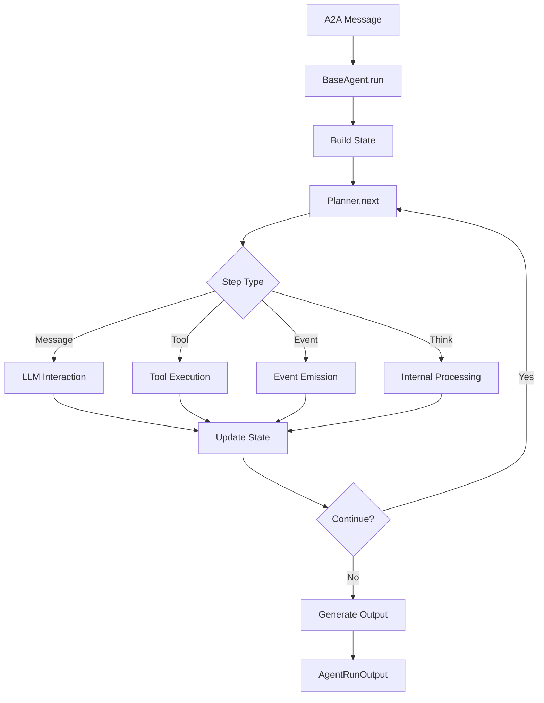

# Agent System Design

## Overview

The Agent System is the core of the CoDIN platform, implementing AI agents that follow the Agent-to-Agent (A2A) protocol for communication and coordination. It provides a framework-agnostic interface for building and orchestrating intelligent agents with pluggable planning strategies.

## Architecture

### Core Components

```
┌─────────────────────────────────────────────────────────────────┐
│                      Agent System                              │
│                                                                 │
│  ┌─────────────────┐    ┌─────────────────┐    ┌─────────────────┐ │
│  │   Agent (ABC)   │    │  BaseAgent      │    │  CodeAgent      │ │
│  │                 │    │  (A2A Protocol) │    │ (Specialized)   │ │
│  └─────────────────┘    └─────────────────┘    └─────────────────┘ │
│           │                       │                       │         │
│  ┌─────────────────┐    ┌─────────────────┐    ┌─────────────────┐ │
│  │ Planner (ABC)   │    │ BasicPlanner    │    │ CodingPlanner   │ │
│  │                 │    │                 │    │                 │ │
│  └─────────────────┘    └─────────────────┘    └─────────────────┘ │
│           │                                                         │
│  ┌─────────────────┐    ┌─────────────────┐    ┌─────────────────┐ │
│  │ AgentConfig     │    │ AgentFactory    │    │   AgentTypes    │ │
│  │                 │    │                 │    │  (Messages)     │ │
│  └─────────────────┘    └─────────────────┘    └─────────────────┘ │
└─────────────────────────────────────────────────────────────────┘
```

## Core Interfaces

### Agent Protocol

```python
class Agent(ABC):
    """Abstract base class for all agents."""
    
    @property
    @abstractmethod
    def agent_id(self) -> str:
        """Unique identifier for the agent."""
        pass
    
    @abstractmethod
    async def run(self, input_data: AgentRunInput) -> AsyncIterator[AgentRunOutput]:
        """Process input and yield output messages."""
        pass
    
    @abstractmethod
    async def cleanup(self) -> None:
        """Clean up agent resources."""
        pass
```

### Planner Protocol

```python
class Planner(ABC):
    """Strategy pattern for agent decision-making."""
    
    @abstractmethod
    async def next(self, state: AgentState) -> AsyncIterator[Step]:
        """Generate next steps based on current state."""
        pass
    
    @abstractmethod
    async def reset(self, state: AgentState) -> None:
        """Reset planner state."""
        pass
```

## Data Flow

### Agent Execution Loop



### Message Processing

1. **Input Validation**: Validate A2A message format
2. **Context Building**: Retrieve conversation history from memory
3. **Planning Loop**: Iterative step generation and execution
4. **Tool Integration**: Execute tools and process results
5. **Output Generation**: Format response as A2A messages
6. **State Management**: Update conversation state and memory

## Implementation Details

### BaseAgent

The `BaseAgent` class provides the core A2A protocol implementation:

```python
class BaseAgent(Agent):
    def __init__(
        self,
        agent_id: str,
        planner: Planner,
        memory: MemoryService = None,
        mailbox: Mailbox = None
    ):
        self.agent_id = agent_id
        self.planner = planner
        self.memory = memory or MemMemoryService()
        self.mailbox = mailbox or LocalMailbox()
    
    async def run(self, input_data: AgentRunInput) -> AsyncIterator[AgentRunOutput]:
        # Build agent state from input and memory
        state = await self._build_state(input_data)
        
        # Execute planning loop
        async for step in self.planner.next(state):
            result = await self._execute_step(step, state)
            if result:
                yield result
            
            # Check termination conditions
            if self._should_terminate(state):
                break
```

### CodeAgent

Specialized agent for coding tasks with enhanced tool integration:

```python
class CodeAgent(Agent):
    def __init__(
        self,
        llm: LLM,
        memory: MemoryService,
        tool_registry: ToolRegistry,
        sandbox: Sandbox,
        agent_id: str = "code_agent"
    ):
        self.llm = llm
        self.memory = memory
        self.tool_registry = tool_registry
        self.sandbox = sandbox
        self.agent_id = agent_id
    
    async def run(self, input_data: AgentRunInput) -> AsyncIterator[AgentRunOutput]:
        # Enhanced loop with tool calling and code execution
        async for message in self._conversation_loop(input_data):
            yield AgentRunOutput(
                id=generate_id(),
                messages=[message],
                runner_id=input_data.runner_id,
                request_id=input_data.request_id
            )
```

## Planning Strategies

### BasicPlanner

Simple sequential planning with predefined step types:

```python
class BasicPlanner(Planner):
    async def next(self, state: AgentState) -> AsyncIterator[Step]:
        # Analyze current state
        if not state.messages:
            yield ThinkStep("No previous messages, starting fresh")
            
        # Generate appropriate response step
        last_message = state.messages[-1]
        if last_message.role == Role.USER:
            yield MessageStep(
                recipient="user",
                content="Processing your request..."
            )
```

### CodingPlanner

Specialized planner for coding tasks with tool integration:

```python
class CodingPlanner(Planner):
    async def next(self, state: AgentState) -> AsyncIterator[Step]:
        # Analyze code-related requests
        if self._needs_file_analysis(state):
            yield ToolStep(
                tool_name="read_file",
                parameters={"path": self._extract_file_path(state)}
            )
        
        elif self._needs_code_execution(state):
            yield ToolStep(
                tool_name="run_command",
                parameters={"command": self._extract_command(state)}
            )
        
        else:
            # Standard message response
            yield MessageStep(
                recipient="user",
                content=await self._generate_response(state)
            )
```

## State Management

### AgentState

Encapsulates current agent execution context:

```python
@dataclass
class AgentState:
    agent_id: str
    runner_id: str
    request_id: str
    messages: List[Message]
    tools_available: List[str]
    budget: Budget
    metadata: Dict[str, Any]
    step_count: int = 0
    max_steps: int = 100
    
    def is_budget_exceeded(self) -> bool:
        return (
            self.step_count >= self.max_steps or
            self.budget.is_exceeded()
        )
```

### Memory Integration

Agents integrate with the memory system for context persistence:

```python
class AgentMemoryManager:
    def __init__(self, memory: MemoryService, agent_id: str):
        self.memory = memory
        self.agent_id = agent_id
    
    async def load_conversation_history(self, runner_id: str) -> List[Message]:
        """Load conversation history for the current session."""
        return await self.memory.get_history(
            session_id=f"{self.agent_id}:{runner_id}"
        )
    
    async def save_message(self, message: Message, runner_id: str) -> None:
        """Save message to conversation history."""
        await self.memory.add_message(
            message,
            session_id=f"{self.agent_id}:{runner_id}"
        )
```

## Event System

### Event Types

Agents emit events for monitoring and coordination:

```python
class EventType(Enum):
    AGENT_START = "agent_start"
    AGENT_STOP = "agent_stop"
    STEP_START = "step_start"
    STEP_COMPLETE = "step_complete"
    TOOL_CALL = "tool_call"
    ERROR = "error"
```

### Event Emission

```python
class EventEmitter:
    def __init__(self):
        self.listeners: Dict[EventType, List[Callable]] = defaultdict(list)
    
    async def emit(self, event_type: EventType, data: Dict[str, Any]) -> None:
        """Emit event to all registered listeners."""
        for listener in self.listeners[event_type]:
            try:
                await listener(event_type, data)
            except Exception as e:
                logger.error(f"Error in event listener: {e}")
    
    def add_listener(self, event_type: EventType, listener: Callable) -> None:
        """Register event listener."""
        self.listeners[event_type].append(listener)
```

## A2A Protocol Compliance

### Message Format

All agent communications follow A2A protocol standards:

```python
@dataclass
class AgentRunInput:
    messages: List[Message]
    runner_id: str
    request_id: str
    tools: Optional[List[str]] = None
    budget: Optional[Budget] = None
    metadata: Optional[Dict[str, Any]] = None

@dataclass
class AgentRunOutput:
    id: str
    messages: List[Message]
    runner_id: str
    request_id: str
    error: Optional[str] = None
    metadata: Optional[Dict[str, Any]] = None
```

### Error Handling

Standardized error propagation and recovery:

```python
class AgentError(Exception):
    def __init__(self, message: str, error_code: str, details: Dict[str, Any] = None):
        self.message = message
        self.error_code = error_code
        self.details = details or {}
        super().__init__(message)

class AgentErrorHandler:
    async def handle_error(self, error: Exception, state: AgentState) -> AgentRunOutput:
        """Convert errors to standardized A2A error responses."""
        if isinstance(error, AgentError):
            return AgentRunOutput(
                id=generate_id(),
                messages=[],
                runner_id=state.runner_id,
                request_id=state.request_id,
                error=f"{error.error_code}: {error.message}"
            )
        else:
            return AgentRunOutput(
                id=generate_id(),
                messages=[],
                runner_id=state.runner_id,
                request_id=state.request_id,
                error=f"INTERNAL_ERROR: {str(error)}"
            )
```

## Configuration

### Agent Configuration

```python
@dataclass
class AgentConfig:
    agent_id: str
    planner_type: str = "basic"
    max_steps: int = 100
    memory_enabled: bool = True
    tool_approval_required: bool = False
    budget_limits: Dict[str, int] = field(default_factory=dict)
    custom_prompts: Dict[str, str] = field(default_factory=dict)
```

### Factory Pattern

```python
class AgentFactory:
    @staticmethod
    async def create_agent(config: AgentConfig, **dependencies) -> Agent:
        """Create agent instance based on configuration."""
        if config.agent_id == "code_agent":
            return CodeAgent(
                llm=dependencies["llm"],
                memory=dependencies["memory"],
                tool_registry=dependencies["tool_registry"],
                sandbox=dependencies["sandbox"]
            )
        else:
            planner = PlannerFactory.create_planner(config.planner_type)
            return BaseAgent(
                agent_id=config.agent_id,
                planner=planner,
                memory=dependencies.get("memory"),
                mailbox=dependencies.get("mailbox")
            )
```

## Integration Points

### Tool System Integration

Agents interact with tools through the registry:

```python
class AgentToolIntegration:
    async def execute_tool(
        self, 
        tool_name: str, 
        parameters: Dict[str, Any],
        context: ToolContext
    ) -> ToolCallResult:
        """Execute tool with agent context."""
        tool = await self.tool_registry.get_tool(tool_name)
        if not tool:
            raise AgentError(f"Tool not found: {tool_name}", "TOOL_NOT_FOUND")
        
        return await tool.execute(context, **parameters)
```

### Sandbox Integration

Code execution through sandbox environments:

```python
class AgentSandboxIntegration:
    async def execute_code(
        self, 
        code: str, 
        language: str = "python"
    ) -> SandboxResult:
        """Execute code in secure sandbox."""
        return await self.sandbox.run(
            SandboxRequest(
                code=code,
                language=language,
                timeout=30.0
            )
        )
```

## Performance Considerations

### Concurrency

- Agents are designed for concurrent execution
- State isolation prevents race conditions
- Async/await throughout for non-blocking operations

### Memory Efficiency

- Lazy loading of conversation history
- Automatic memory chunking for long conversations
- Cleanup of temporary state after execution

### Scalability

- Stateless agent design enables horizontal scaling
- Actor model isolation for fault tolerance
- Pluggable backends for different deployment scenarios

## Testing Strategy

### Unit Tests

- Mock dependencies for isolated testing
- Test each planner strategy independently
- Validate A2A protocol compliance

### Integration Tests

- End-to-end message processing
- Tool integration scenarios
- Error handling and recovery

### Performance Tests

- Concurrent agent execution
- Memory usage profiling
- Response time benchmarking

## Usage Examples

### Example 1: Code Analysis Agent

```python
from codin.agent.base_agent import BaseAgent
from codin.agent.code_planner import CodePlanner, CodePlannerConfig
from codin.agent.types import AgentRunInput, RunConfig, Message, Role, TextPart
from codin.memory.base import MemMemoryService
from codin.tool.registry import ToolRegistry
from codin.tool import SandboxToolset
from codin.sandbox.local import LocalSandbox
from codin.model.factory import LLMFactory

async def create_code_analysis_agent():
    """Create a specialized agent for code analysis tasks."""
    
    # Initialize sandbox and tools
    sandbox = LocalSandbox()
    await sandbox.up()
    
    tool_registry = ToolRegistry()
    sandbox_toolset = SandboxToolset(sandbox)
    await sandbox_toolset.up()
    tool_registry.register_toolset(sandbox_toolset)
    
    # Create LLM for code analysis
    llm = LLMFactory.create_llm(model="gpt-4")
    
    # Configure planner for code analysis
    planner_config = CodePlannerConfig(
        model="gpt-4",
        max_tokens=4000,
        temperature=0.1,  # Lower temperature for more deterministic analysis
        max_tool_calls_per_turn=10,
        thinking_enabled=True,
        rules="Analyze code systematically for bugs, security issues, and improvements."
    )
    
    planner = CodePlanner(
        config=planner_config,
        llm=llm,
        tool_registry=tool_registry
    )
    
    # Create agent with analysis-specific configuration
    run_config = RunConfig(
        turn_budget=15,
        time_budget_seconds=300,
        token_budget=8000
    )
    
    agent = BaseAgent(
        agent_id="code-analyzer",
        name="CodeAnalysisAgent",
        description="Specialized agent for analyzing code quality and security",
        planner=planner,
        memory=MemMemoryService(),
        tools=tool_registry.get_tools(),
        llm=llm,
        default_config=run_config
    )
    
    return agent, sandbox

# Usage example
async def analyze_codebase():
    agent, sandbox = await create_code_analysis_agent()
    
    try:
        # Create analysis task
        task_message = Message(
            messageId="analysis-task",
            role=Role.user,
            parts=[TextPart(text="""
Analyze the Python files in the src/ directory for:
1. Security vulnerabilities
2. Code quality issues  
3. Performance bottlenecks
4. Best practice violations

Provide a detailed report with specific recommendations.
""")],
            contextId="analysis-session",
            kind="message"
        )
        
        agent_input = AgentRunInput(
            session_id="analysis-session",
            message=task_message,
            options={}
        )
        
        # Execute analysis
        async for output in agent.run(agent_input):
            if hasattr(output, "result") and output.result:
                for part in output.result.parts:
                    if hasattr(part, "text"):
                        print(f"Analysis: {part.text}")
    
    finally:
        await agent.cleanup()
        await sandbox.down()
```

### Example 2: Multi-Agent Development Team

```python
from codin.agent.base_agent import BaseAgent
from codin.agent.plan_execute_agent import PlanExecuteAgent

async def create_development_team():
    """Create a team of specialized agents for software development."""
    
    # Shared resources
    sandbox = LocalSandbox()
    await sandbox.up()
    tool_registry = ToolRegistry()
    sandbox_toolset = SandboxToolset(sandbox)
    await sandbox_toolset.up()
    tool_registry.register_toolset(sandbox_toolset)
    
    # Architect Agent - Plans system architecture
    architect_config = CodePlannerConfig(
        model="gpt-4",
        temperature=0.3,
        rules="Focus on system design, architecture patterns, and scalability."
    )
    
    architect = BaseAgent(
        agent_id="architect",
        name="SystemArchitect",
        description="Designs software architecture and system components",
        planner=CodePlanner(architect_config, LLMFactory.create_llm(), tool_registry),
        memory=MemMemoryService(),
        tools=tool_registry.get_tools(),
        llm=LLMFactory.create_llm()
    )
    
    # Developer Agent - Implements features
    developer_config = CodePlannerConfig(
        model="gpt-4",
        temperature=0.2,
        max_tool_calls_per_turn=15,
        rules="Write clean, tested code following the architectural plan."
    )
    
    developer = BaseAgent(
        agent_id="developer",
        name="SoftwareDeveloper", 
        description="Implements features based on architectural specifications",
        planner=CodePlanner(developer_config, LLMFactory.create_llm(), tool_registry),
        memory=MemMemoryService(),
        tools=tool_registry.get_tools(),
        llm=LLMFactory.create_llm()
    )
    
    # Tester Agent - Creates and runs tests
    tester_config = CodePlannerConfig(
        model="gpt-4",
        temperature=0.1,
        rules="Create comprehensive tests and validate functionality."
    )
    
    tester = BaseAgent(
        agent_id="tester",
        name="QualityAssurance",
        description="Creates tests and validates software quality",
        planner=CodePlanner(tester_config, LLMFactory.create_llm(), tool_registry),
        memory=MemMemoryService(),
        tools=tool_registry.get_tools(),
        llm=LLMFactory.create_llm()
    )
    
    return {
        "architect": architect,
        "developer": developer, 
        "tester": tester,
        "sandbox": sandbox
    }

# Coordinate team to build a feature
async def build_authentication_system():
    team = await create_development_team()
    
    try:
        # Step 1: Architecture phase
        arch_task = Message(
            role=Role.user,
            parts=[TextPart(text="""
Design a JWT-based authentication system with:
- User registration and login
- Token generation and validation
- Password hashing and security
- Session management
Provide detailed architecture and file structure.
""")],
            contextId="auth-project"
        )
        
        arch_input = AgentRunInput(session_id="auth-project", message=arch_task)
        
        print("🏗️ Architecture Phase:")
        architecture_plan = None
        async for output in team["architect"].run(arch_input):
            if output.result:
                architecture_plan = output.result.parts[0].text
                print(f"Architecture: {architecture_plan}")
        
        # Step 2: Development phase  
        dev_task = Message(
            role=Role.user,
            parts=[TextPart(text=f"""
Based on this architecture plan:
{architecture_plan}

Implement the authentication system. Create all necessary files and code.
""")],
            contextId="auth-project"
        )
        
        dev_input = AgentRunInput(session_id="auth-project", message=dev_task)
        
        print("💻 Development Phase:")
        async for output in team["developer"].run(dev_input):
            if output.result:
                print(f"Implementation: {output.result.parts[0].text}")
        
        # Step 3: Testing phase
        test_task = Message(
            role=Role.user,
            parts=[TextPart(text="""
Create comprehensive tests for the authentication system:
- Unit tests for all components
- Integration tests for the API
- Security tests for vulnerabilities
- Performance tests for load handling
""")],
            contextId="auth-project"
        )
        
        test_input = AgentRunInput(session_id="auth-project", message=test_task)
        
        print("🧪 Testing Phase:")
        async for output in team["tester"].run(test_input):
            if output.result:
                print(f"Testing: {output.result.parts[0].text}")
    
    finally:
        for agent in ["architect", "developer", "tester"]:
            await team[agent].cleanup()
        await team["sandbox"].down()
```

### Example 3: Plan-Execute Agent for Complex Tasks

```python
from codin.agent.plan_execute_agent import PlanExecuteAgent
from codin.agent.plan_execute_planner import PlanExecutePlanner

async def create_plan_execute_agent():
    """Create an agent that plans and executes complex development tasks."""
    
    # Set up tools and resources
    sandbox = LocalSandbox()
    await sandbox.up()
    
    tool_registry = ToolRegistry()
    sandbox_toolset = SandboxToolset(sandbox)
    await sandbox_toolset.up()
    tool_registry.register_toolset(sandbox_toolset)
    
    # Create plan-execute agent
    agent = PlanExecuteAgent(
        agent_id="plan-execute-dev",
        llm=LLMFactory.create_llm(model="gpt-4"),
        memory=MemMemoryService(),
        tool_registry=tool_registry,
        sandbox=sandbox
    )
    
    return agent, sandbox

# Use plan-execute pattern for complex task
async def build_rest_api():
    agent, sandbox = await create_plan_execute_agent()
    
    try:
        complex_task = Message(
            role=Role.user,
            parts=[TextPart(text="""
Build a complete REST API for a task management system with:

1. Database models (User, Task, Project)
2. Authentication endpoints (register, login, logout)
3. CRUD operations for tasks and projects
4. User authorization and permissions
5. Input validation and error handling
6. API documentation with OpenAPI/Swagger
7. Unit and integration tests
8. Docker containerization
9. Basic CI/CD pipeline configuration

Use Python with FastAPI framework and PostgreSQL database.
""")],
            contextId="api-project"
        )
        
        agent_input = AgentRunInput(
            session_id="api-project",
            message=complex_task
        )
        
        print("🎯 Plan-Execute Agent Building REST API:")
        print("=" * 50)
        
        async for output in agent.run(agent_input):
            if output.result:
                for part in output.result.parts:
                    if hasattr(part, "text"):
                        print(part.text)
                        print("-" * 30)
    
    finally:
        await agent.cleanup()
        await sandbox.down()
```

This design provides a flexible, scalable foundation for building AI agents that can work together in the CoDIN platform while maintaining protocol compliance and operational safety.