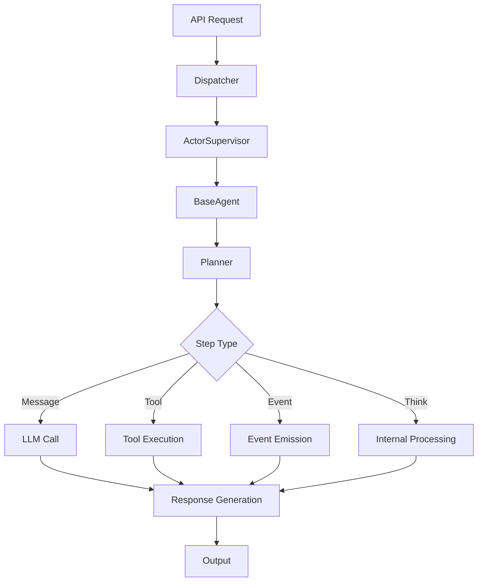
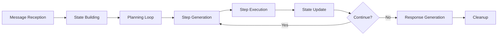

# CoDIN Platform Architecture

## Overview

The CoDIN (Collaborative Distributed Intelligence Network) platform is a sophisticated, modular framework for building and orchestrating AI agents. It implements a distributed actor system with Agent-to-Agent (A2A) communication protocol for scalable, concurrent agent execution.

## System Architecture

### High-Level Architecture

```
┌─────────────────────────────────────────────────────────────────┐
│                          API Layer                              │
│  ┌─────────────────┐  ┌─────────────────┐  ┌─────────────────┐ │
│  │   FastAPI       │  │   WebSocket     │  │   CLI           │ │
│  │   Endpoints     │  │   Streaming     │  │   Interface     │ │
│  └─────────────────┘  └─────────────────┘  └─────────────────┘ │
└─────────────────────────────────────────────────────────────────┘
                                │
┌─────────────────────────────────────────────────────────────────┐
│                    Orchestration Layer                         │
│  ┌─────────────────┐  ┌─────────────────┐  ┌─────────────────┐ │
│  │   Dispatcher    │  │ ActorSupervisor │  │  TaskRegistry   │ │
│  │   (Routing)     │  │  (Lifecycle)    │  │   (Tracking)    │ │
│  └─────────────────┘  └─────────────────┘  └─────────────────┘ │
└─────────────────────────────────────────────────────────────────┘
                                │
┌─────────────────────────────────────────────────────────────────┐
│                       Agent Layer                              │
│  ┌─────────────────┐  ┌─────────────────┐  ┌─────────────────┐ │
│  │   BaseAgent     │  │   CodeAgent     │  │    Planners     │ │
│  │  (A2A Protocol)│  │  (Specialized)  │  │  (Strategies)   │ │
│  └─────────────────┘  └─────────────────┘  └─────────────────┘ │
└─────────────────────────────────────────────────────────────────┘
                                │
┌─────────────────────────────────────────────────────────────────┐
│                      Service Layer                             │
│  ┌──────────┐ ┌──────────┐ ┌──────────┐ ┌──────────┐ ┌──────────┐ │
│  │   Tool   │ │  Memory  │ │  Model   │ │ Prompt   │ │ Endpoint │ │
│  │ Registry │ │ Service  │ │ Factory  │ │ Engine   │ │ Resolver │ │
│  └──────────┘ └──────────┘ └──────────┘ └──────────┘ └──────────┘ │
└─────────────────────────────────────────────────────────────────┘
                                │
┌─────────────────────────────────────────────────────────────────┐
│                   Infrastructure Layer                         │
│  ┌─────────────────┐  ┌─────────────────┐  ┌─────────────────┐ │
│  │   Sandboxes     │  │   Extensions    │  │  Configuration  │ │
│  │  (Execution)    │  │ (Auth/Metrics)  │  │   Management    │ │
│  └─────────────────┘  └─────────────────┘  └─────────────────┘ │
└─────────────────────────────────────────────────────────────────┘
```

## Core Components

### 1. Actor System
- **Purpose**: Concurrent, fault-tolerant agent execution
- **Pattern**: Actor model with supervision trees
- **Components**:
  - `Dispatcher`: Request routing and load balancing
  - `ActorSupervisor`: Lifecycle management and fault tolerance
  - `TaskRegistry`: Task tracking and state management

### 2. Agent System
- **Purpose**: AI agent implementations with A2A protocol
- **Pattern**: Strategy pattern for pluggable planning
- **Components**:
  - `BaseAgent`: Core A2A protocol implementation
  - `CodeAgent`: Specialized coding assistant
  - `Planner`: Execution strategy abstraction

### 3. Tool System
- **Purpose**: External functionality integration
- **Pattern**: Plugin architecture with registry
- **Components**:
  - `ToolRegistry`: Centralized tool discovery
  - `ToolExecutor`: Execution with extensions
  - `Extensions`: Approval, auth, logging, metrics

### 4. Memory System
- **Purpose**: Conversation history and context management
- **Pattern**: Repository with chunking strategies
- **Components**:
  - `MemoryService`: Unified memory interface
  - `MemoryChunk`: Structured storage units
  - `ChunkBuilder`: Summarization strategies

### 5. Sandbox System
- **Purpose**: Secure code execution environments
- **Pattern**: Strategy pattern for multiple backends
- **Components**:
  - `LocalSandbox`: Local process execution
  - `CodexSandbox`: Cloud-based execution
  - `E2BSandbox`: E2B platform integration

## Data Flow

### Request Processing Flow



### Agent Execution Loop



## Design Principles

### 1. Modularity
- Clear separation of concerns
- Pluggable component architecture
- Dependency injection patterns

### 2. Scalability
- Actor model for horizontal scaling
- Stateless service design
- Efficient resource management

### 3. Extensibility
- Plugin architectures for tools and sandboxes
- Strategy patterns for configurable behavior
- Endpoint-based service discovery

### 4. Safety
- Sandbox isolation for code execution
- Approval modes for sensitive operations
- Hierarchical error handling

### 5. Observability
- Comprehensive logging and metrics
- Event-driven monitoring
- Distributed tracing support

## Integration Patterns

### Endpoint Configuration
Unified URL scheme for service discovery:
- `fs://path/to/config` - Filesystem-based configuration
- `http://service/endpoint` - HTTP service integration
- `mcp://server/tools` - Model Context Protocol servers

### A2A Protocol Compliance
All agents implement standardized message formats:
- Request/Response envelope structure
- Consistent error handling
- Standardized metadata and routing

### Component Lifecycle
Consistent up/down patterns across all components:
- Graceful startup and shutdown
- Health check endpoints
- Resource cleanup on termination

## Technology Stack

### Core Framework
- **Python 3.11+**: Primary implementation language
- **AsyncIO**: Asynchronous programming model
- **Pydantic**: Data validation and serialization
- **FastAPI**: REST API framework

### External Integrations
- **Multiple LLM Providers**: OpenAI, Anthropic, Google, etc.
- **MCP Protocol**: Model Context Protocol for tool integration
- **Container Platforms**: Docker, E2B for sandboxing
- **Storage Backends**: Filesystem, HTTP, cloud storage

### Development Tools
- **pytest**: Testing framework
- **Black**: Code formatting
- **mypy**: Type checking
- **ruff**: Linting

## Deployment Architecture

### Local Development
- Single-process mode with LocalActorManager
- File-based configuration and storage
- Direct tool and sandbox execution

### Production Deployment
- Distributed actor system with Ray backend
- Centralized configuration management
- Horizontal scaling with load balancing
- Monitoring and alerting integration

## Security Model

### Isolation Boundaries
- Sandbox environments for code execution
- Tool execution with approval gates
- Memory isolation between sessions

### Authentication & Authorization
- API key management for external services
- User-based access control
- Tool-level permission systems

### Data Protection
- Sensitive data masking in logs
- Secure credential storage
- Encrypted communication channels

## Performance Characteristics

### Concurrency
- Multiple agents per actor supervisor
- Concurrent tool execution
- Streaming response generation

### Resource Management
- Memory-efficient conversation handling
- Lazy loading of components
- Automatic resource cleanup

### Optimization
- Connection pooling for external services
- Caching for frequently used data
- Batch processing where applicable

## Monitoring & Observability

### Metrics Collection
- Request latency and throughput
- Error rates and patterns
- Resource utilization

### Logging
- Structured logging with correlation IDs
- Different log levels per component
- Sensitive data filtering

### Tracing
- Distributed request tracing
- Component interaction visibility
- Performance bottleneck identification

This architecture provides a robust foundation for building sophisticated AI agent applications with enterprise-grade reliability, scalability, and maintainability.