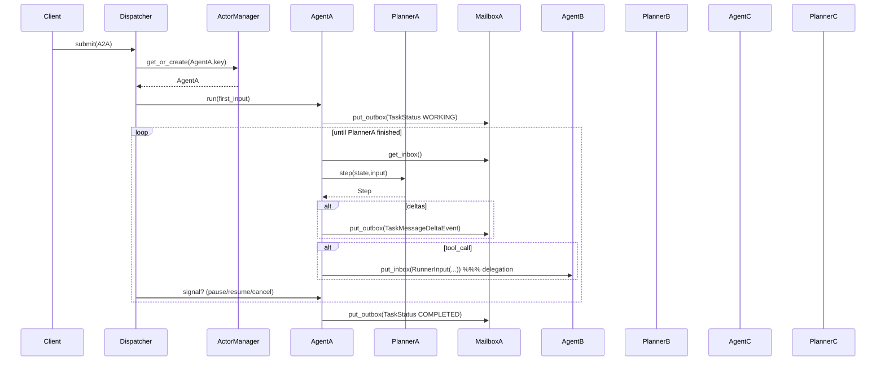

Below is an updated **implementation-ready design note** that:

* **abstracts Dispatcher** and the **ActorManager** (renamed from Life-cycle) so the same code runs on **local asyncio**, **Ray**, **Kubernetes + CRD/Operator**, or **Dapr**;
* upgrades the **Mailbox** to a *bidirectional* queue pair--`inbox` (control/user feedback) and `outbox` (events/deltas);
* aligns all API names (`Planner.step`, `Agent.run`, `Dispatcher.submit`, `ActorManager.get_or_create`);
* shows how a client call fans-out to three planners that can talk to each other;
* provides Python interface stubs that compile unmodified on every backend.

---

## Quick summary

A client HTTP request is parsed by the **Dispatcher**, which asks an **ActorManager** to `get_or_create` three **Agents** (wrappers that own mailboxes, budgets, and a **Planner**).
Each Agent drains its `inbox`, pushes deltas/tool-calls to its `outbox`, and keeps calling `Planner.step(state,input)` until the planner returns a `Step(finished=True)` or budgets/timeouts fire. The Dispatcher streams every `outbox` frame to the client in A2A format and can inject **control** messages (pause/resume/cancel/reset) at any time through the same queue.

---

## 1 Core runtime concepts

| # | Concept           | Minimal responsibility                                                                      | Ray binding                                            | Dapr / K8s binding                                        |
| - | ----------------- | ------------------------------------------------------------------------------------------- | ------------------------------------------------------ | --------------------------------------------------------- |
| 1 | **Planner**       | Pure reasoning function `step(state,in)→Step`                                               | lives *inside* a Ray Actor worker                      | lives inside a side-car’d pod                             |
| 2 | **Agent**         | Owns *inbox/outbox* queues, budgets, calls Planner, executes tool-calls, implements `run()` | a named **Ray Actor**                                  | a **Dapr Actor** or K8s CRD instance                      |
| 3 | **Mailbox**       | `inbox` & `outbox` FIFO queues with back-pressure                                           | `ray.util.queue.Queue` async/await API                 | side-car request queue (Dapr) or `asyncio.Queue` in-proc  |
| 4 | **ActorManager**  | `get_or_create(type,key)` and `deactivate(handle)`                                          | `ray.get_actor` or `ActorClass.options(name).remote()` | HTTP PUT to `/v1.0/actors/<type>/<id>` (Dapr) / create CR |
| 5 | **Dispatcher**    | Parses HTTP → A2A, creates Agents, relays control, enforces global concurrency              | **Ray Serve** FastAPI ingress                          | plain FastAPI under `dapr run`                            |


---

## 2 Bidirectional Mailbox interface

```python
class Mailbox(Protocol):
    # ---- producer side ----
    async def put_inbox(self, msg: Message) -> None
    async def put_outbox(self, msg: Message | Event) -> None  # A2A JSON
    # ---- consumer side ----
    async def get_inbox(self, timeout: float | None = None) -> Message
    async def get_outbox(self, timeout: float | None = None) -> Message

    async def subscribe_inbox(self) -> AsyncIterator[Message | Event]
    async def subscribe_outbox(self) -> AsyncIterator[Message | Event]
```

Local impl: two `asyncio.Queue(maxsize=N)` objects (back-pressure via `await queue.put()`).
Ray impl: two `ray.util.queue.Queue(maxsize=N)` objects hosted in the same Ray actor for zero-copy across workers.

---

## 3 Essential Python APIs

```python

class ActorManager(Protocol):
    async def get_or_create(self, actor_type: str, key: str) -> Agent: ...
    async def deactivate(self, agent_id: str) -> None: ...

class Dispatcher(Protocol):
    async def submit(self, a2a_request: dict) -> str      # returns runner_id
    async def signal(self, agent_id: str, ctrl: str) -> None
```

---

## 4 Unified sequence diagrams

### 4.1 Dispatcher → three agents (bidirectional queues)



*(AgentB / AgentC have symmetric loops; omitted for brevity.)*

### 4.2 Control feedback into `inbox`

User presses “pause” → Dispatcher → `Agent.put_inbox(RunnerInput(control="pause"))`.
The next `AgentA.get_inbox()` yields this signal and Planner can respond immediately.

---

## 5 Back-end binding cheatsheet

| Mechanism          | Local `asyncio`                      | Ray cluster                            | Dapr/K8s                                        |
| ------------------ | ------------------------------------ | -------------------------------------- | ----------------------------------------------- |
| Mailbox queues     | `asyncio.Queue`                      | `ray.util.queue.Queue` inside an actor | side-car (inbox) + Channel CR / `asyncio.Queue` |
| ActorManager       | dict of live Agent objects           | namespaced `ray.get_actor`             | Placement service + CRD                         |
| Dispatcher ingress | FastAPI route                        | `@serve.deployment` FastAPI            | FastAPI under `dapr run`                        |
| Agent lifetime     | local task; `asyncio.CancelledError` | named Actor; `ray.kill` / idle-timeout | Deactivation timer (`actorIdleTimeout`)         |
| Tool sandbox       | subprocess / Firecracker             | Ray task or nested actor               | side-car container                              |

---

## 6 Why only these parts are sufficient

1. **Bidirectional mailbox** replaces ad-hoc websockets: same back-pressure semantics and works in local tests as well as clusters.
2. **ActorManager** abstracts Ray’s GCS, Dapr’s placement, or a Python dict, letting the Dispatcher call a single method.
3. **Planner/Agent split** keeps LLM logic protocol-free; swap ChatGPT with Claude or Gemini without touching Mailbox or Dispatcher.
4. **Dispatcher** remains a thin purely-stateless HTTP parser + governor, portable across any orchestrator.

With these abstractions and interfaces you can compile the same code in a Jupyter cell (all-local `asyncio`), deploy to a Ray GPU cluster, or package each Planner as a tiny Dapr-enabled micro-service on Kubernetes—no refactors needed.
